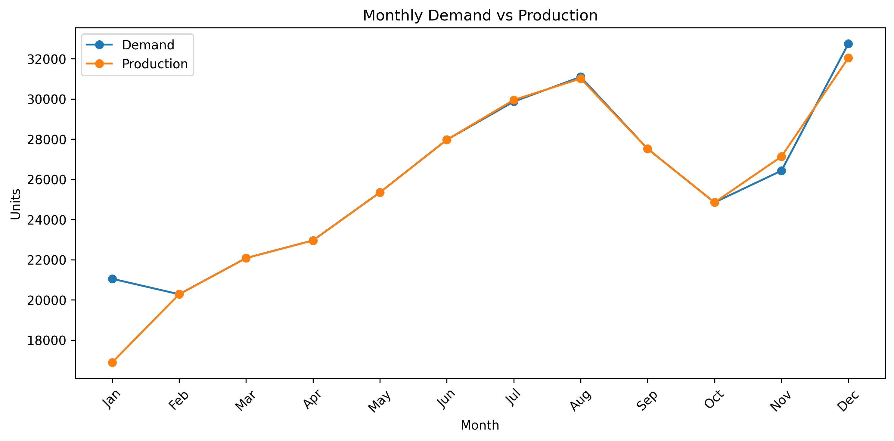
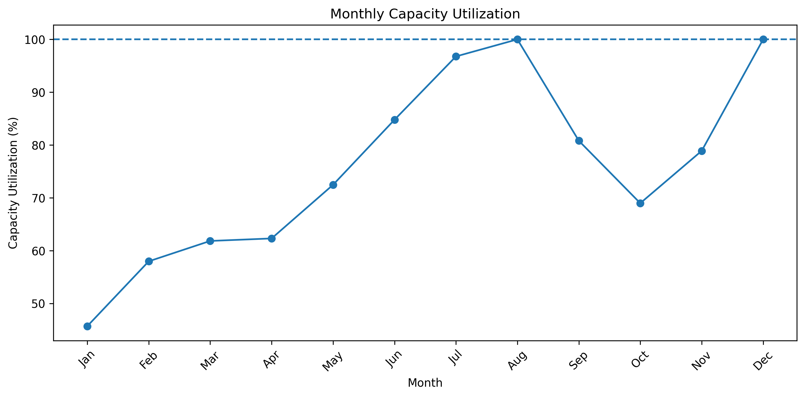
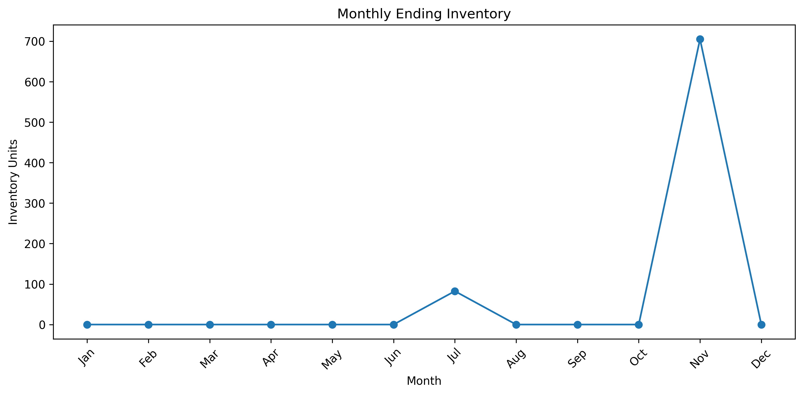
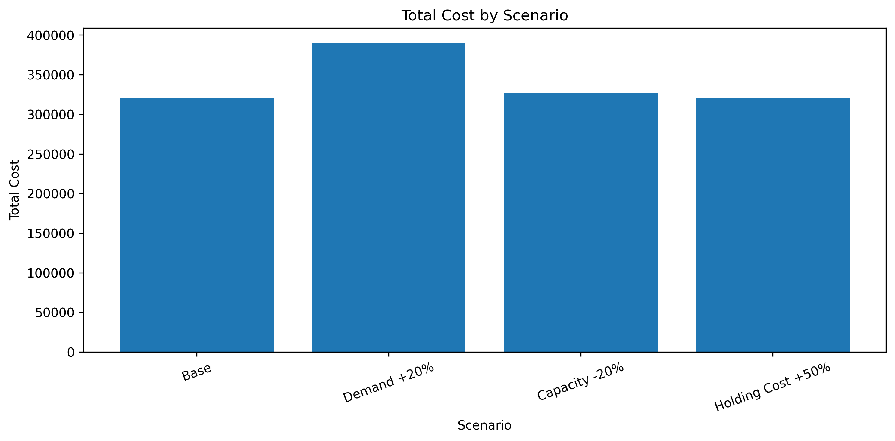

# Production Planning Optimization using Linear Programming

## 📌 Project Overview

This project develops a Linear Programming (LP) model to optimize production planning and inventory decisions for a manufacturing company.

The model determines how much to produce for each SKU in each month while minimizing total production and inventory holding costs, subject to production capacity and inventory constraints.

## 🎯 Business Problem

The company needs to plan production for 15 SKUs over a 12-month planning horizon.

The main challenges are:

- Different demand levels across SKUs and months
- Limited monthly production capacity
- Production costs vary by SKU
- Holding inventory incurs additional costs
- Inventory capacity is limited

The objective is to find the optimal production plan that satisfies demand at the minimum total cost.

## 🧮 Optimization Model

### Decision Variables

**Production quantity**

$$
X_{p,t} = \text{quantity of SKU } p \text{ produced in month } t
$$

**Ending inventory**

$$
I_{p,t} = \text{ending inventory of SKU } p \text{ in month } t
$$

### Objective

Minimize total production and inventory holding costs:

$$
\min \sum_{p,t}
(C_p X_{p,t} + H_p I_{p,t})
$$

### Key Constraints

**Inventory balance**

$$
I_{p,t-1} + X_{p,t} - D_{p,t} = I_{p,t}
$$

**Production capacity**

$$
\sum_p T_p X_{p,t} \leq Capacity_t
$$

**Inventory capacity**

$$
I_{p,t} \leq MaxInventory_p
$$

## 🛠️ Tools & Technologies

- Python
- Pandas
- PuLP
- Matplotlib
- Linear Programming

## 📊 What-if Scenario Analysis

The model will be extended to evaluate different business scenarios, such as:

- Demand increase/decrease
- Production capacity changes
- Changes in inventory holding costs

The objective is to understand how changes in business assumptions affect the optimal production plan, inventory levels, and total cost.

## Results & Insights

### Monthly Demand vs Production

### Insight

- Production generally follows the demand pattern across the planning horizon.
- In some months, production is lower than demand because available inventory from previous months is used to fulfill demand.
- This indicates that the optimization model is able to shift production across months while maintaining demand fulfillment.

### Business Implication

The production plan does not require production to exactly match monthly demand. 
Carrying inventory across periods provides flexibility to balance production capacity and demand fluctuations.

### Capacity Utilization 

### Insight

- Capacity utilization reached highest at 100% in August and December, making these two the most capacity-constrained months in the planning horizon
- Months with higher utilization indicate periods where production capacity is more constrained.
- These periods may represent potential bottlenecks if demand increases further.

### Business Implication

Production capacity should be monitored closely during high-utilization months. 
Additional capacity or earlier production may be required under higher-demand scenarios.

### Inventory

### Insight

- Inventory is carried into periods where production capacity reached its peak and may not be sufficient to fully cover demand.
- Positive holding costs discourage unnecessary inventory accumulation.

### Business Implication

The optimized plan balances the trade-off between producing earlier and holding inventory versus producing later with available capacity.

### What - If scenarios

### Insight

- The Demand +20% scenario increases total cost as additional production is required to meet higher demand.
- The Capacity -20% scenario may require production to be shifted across months, remain almost the same total cost as base scenario with higher average capacity utilization. However, higher capacity decrease may cause supply risk for unpredictable demand spike.
- The Holding Cost +50% scenario increases the cost of carrying inventory, however the increase is not significant. 

### Business Implication

Capacity constraints and demand uncertainty have a direct impact on production planning decisions. 
Scenario analysis helps identify potential cost increases and capacity risks before they occur.
